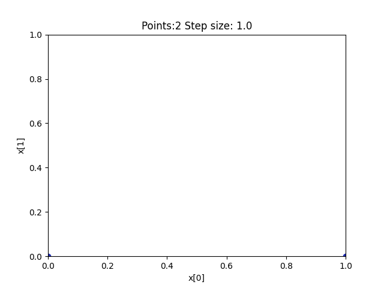
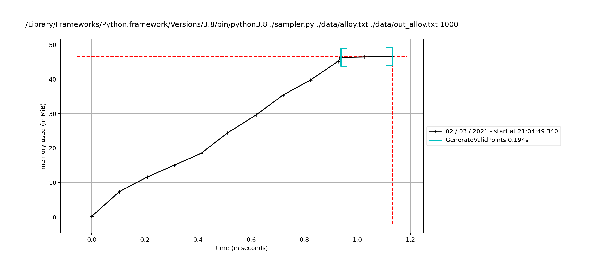

# Citrine Informatics Technical Challenge
#### *Data and AI Research Engineer*
#### *Version: e6b4a7f0da67f298a09e9550d848bfb86bbc028b*
---

## Problem Outline
Deliver a script that can be run as `./sampler input_file output_file n_results` along with installation instructions. The input file contains the dimensionality of the problem, a single feasible point, and a list of constraints. The output file should contain a list of vectors (space delimited within the vector; one vector per line).

### Update on 03/08/2021
Code quality: the code could be adapted to a production environment. It should be reliable and structured in such a way that other developers could maintain and modify it.

---

## Solution:
### Instructions
The script can be run as below:

```./sampler.py input_file output_file 1000```

It uses the Generator class to generate the required number of points that sastisfy the given constrants. These are then written to the specified output file. The script also uses a Validator class to verify that the generated points in the output file satisfy the constraints in the corresponding input file.

The following log files are produced:
* log_generator.log: information from point generation
* log_validator.log: information from validation

The provided data files are in the data folder.

### Explanation
* The script starts with the given feasible sample point and explores outward (incrementing and decrementing by a particular step size) in each dimension. Any valid points found are added to a queue and set of found points.
* While the queue is non-empty, each point is popped off and explored at the same step size and valid points are added to queue and set.
* The step size is then halved and the search is re-done on a queue that contains the valid points found thus far.
* This process is repeated till the required number of points are found


### Pseudocode
```
step_size = 1.0
while (n_found_points < n_required_points):
    queue.append(all known valid points)

	while queue and (n_found_points < n_required_points):
        current_point = queue.popleft()
        
        explore(current_point, step_size):
            queue.append(found valid points)
            valid_points.add(found valid points)
    
    step_size /= 2
```

### Demonstration
* The points collected from mixture.txt (and the pattern in which they are filled) is shown below.


### Timing and Memory
* The timing (calculated using the [`time`](https://docs.python.org/3/library/time.html) library) is shown.
This algorithm finds 1000 points spread over the sample space in under 1 second for each given sample dataset. 

| Input Sample      | Time Taken    | Dimensions    | Points Generated  |
| ---               | ---           | ---           | ---               |
| mixture.txt       | 0.04118       | 2             | 1000              |
| example.txt       | 0.10401       | 4             | 1000              |
| formulation.txt   | 0.09594       | 4             | 1000              |
| alloy.txt         | 0.16853       | 11            | 1000              |

The memory usage for alloy.txt (calculated using [`memory-profiler`](https://pypi.org/project/memory-profiler/)) is shown below:


### Advantages:
* The algorithm is very fast and does not take up a lot of memory (see above).
* The step size is consistently decreased (1.0, 0.5, 0.25, 0.125…) and the points found fill the valid space uniformly.

### Drawbacks:
* An initial point is required to begin the search.
* High dimensional problems with restricted regions of validity may not be explored uniformly in all dimensions.
* The points filled at the smallest step size may not be uniform in all dimensions.
* If the valid region is discontinuous, all subregions may not be found.
* The given starting point can influence the points that are found by the script.