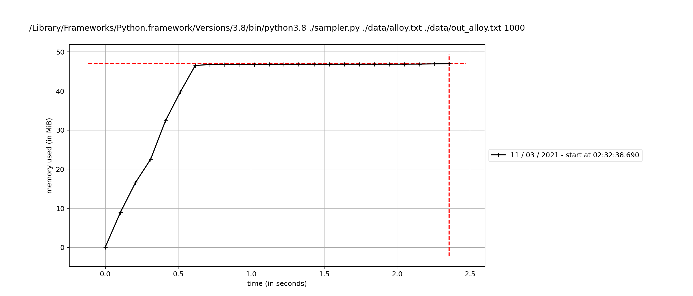

# Citrine Informatics Technical Challenge
#### *Data and AI Research Engineer*
#### *Version: e6b4a7f0da67f298a09e9550d848bfb86bbc028b*
---

## Problem Outline
Deliver a script that can be run as `./sampler input_file output_file n_results` along with installation instructions. The input file contains the dimensionality of the problem, a single feasible point, and a list of constraints. The output file should contain a list of vectors (space delimited within the vector; one vector per line). 

---

## Solution:
### Instructions
The script can be run as below:

```./sampler.py input_file output_file 1000```

It uses a Generator class to generate the required number of points that sastisfy the given constrants. These are then written to the specified output file. The script also uses a Validator class to verify that the generated points in the output file satisfy the constraints in the corresponding input file.

The following log files are produced:
* log_generator.log contains information from the point generation
* log_validator.log contains information from validating the output file

### Explanation
The script starts with the given feasible sample point and explores outward (incrementing and decrementing by a particular step size) in each dimension. Any valid points found are added to a queue. While the queue is non-empty, each point is popped off and explored at the same step size and valid points are added to queue. Each explored point is also added to the set of valid points. The step size is then halved and the search is re-done on a queue that contains the valid points found so far.

### Pseudocode
```
step_size = 1
while (n_found_points < n_required_points):
	queue.add(all points in valid_points)

	while queue and (n_found_points < n_required_points):
		current_point = queue.popleft()
        
        for each dimension in current_point:
            for positive and negative direction:
			    next_point = explore(current_point)
			
                if next_point is valid:
                    queue.add(next_point)
		
        valid_points.add(current_point)
	
    step_size /= 2
    
```

At the end of this loop, the valid_points set will contain the required number of valid points.

Since the exploration is done on the entire space at each step size, and the step size is consistently decreased (1.0, 0.5, 0.25, 0.125…), the points found fill the valid space in a uniform manner.

The points collected from mixture.txt (and the pattern in which they are filled) is shown below.


---

## Timing and Memory
The timing (calculated using the `time` library)
This code finds 1000 points in under 5 seconds for each given sample dataset. 

| Input Sample  | Time Taken    | Dimensions    | Points Generated  |
| ---           | ---           | ---           | ---               |
| mixture.txt   | 0.xxxx        | 2             | 1000              |
| example.txt   | 0.xxxx        | 4             | 1000              |
| formulation   | 0.xxxx        | 4             | 1000              |
| alloy.txt     | 0.xxxx        | 11            | 1000              |

The memory usage for alloy.txt (calculated using [`memory-profiler`](https://pypi.org/project/memory-profiler/)) is shown below:


---

## Drawbacks:
* An initial point is required to begin the search
* All the points have to be put in a set so the memory footprint can be large for high dimensional problems where many points are required
* The points filled at the smallest step size may not be uniform in all dimensions
* If the valid region is discontinuous, all subregions may not be found
* Floating point errors can happen if the point is close to 0